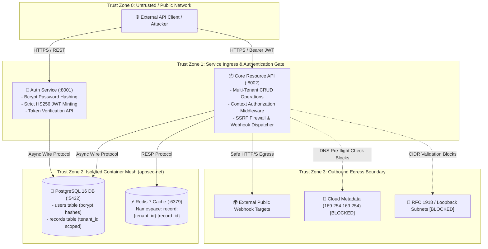

# Enterprise AppSec Microservices Benchmark & Security Framework

[](https://github.com/yasaman138/appsec/actions/workflows/security.yml)
[](https://www.python.org/)
[](https://fastapi.tiangolo.com)
[](https://www.postgresql.org)
[](https://redis.io)
[](https://semgrep.dev)
[-brightgreen.svg)](#-shift-left-cicd-security-gates)

A production-grade, containerized microservices security benchmark engineered to demonstrate multi-tenant data isolation, automated exploit harnesses, shift-left DevSecOps automation, and defense-in-depth remediation against OWASP Top 10 and API Security Top 10 vulnerabilities.

---

## 📑 Table of Contents

1. [Executive Summary](#-executive-summary)
2. [System Architecture & Trust Zones](#-system-architecture--trust-zones)
3. [Shift-Left CI/CD Security Gates](#-shift-left-cicd-security-gates)
4. [Vulnerability Lifecycle & Remediation Matrix](#-vulnerability-lifecycle--remediation-matrix)
5. [Quickstart & Execution](#-quickstart--execution)
6. [Security Documentation & Threat Modeling](#-security-documentation--threat-modeling)
7. [CV / Resume-Ready Impact Framework](#-cv--resume-ready-impact-framework)

---

## 🏛️ Executive Summary

Modern cloud-native architectures require rigorous multi-tenant security guarantees, proactive static analysis, and automated exploit regression suites. This repository serves as an end-to-end security benchmark showcasing:
- **Decoupled Microservice Mesh:** High-throughput Auth Service and Core Resource API with asynchronous SQLAlchemy ORM, PostgreSQL persistence, and Redis caching.
- **Multi-Tenant Isolation:** Database-level compound predicate scoping and tenant-isolated caching namespaces.
- **Automated Exploit Harness:** Deterministic `pytest` exploit suite proving exploitability in vulnerable states and regression resistance post-remediation.
- **Automated Shift-Left DevSecOps:** GitHub Actions pipeline integrating secret scanning (Gitleaks), container/SCA vulnerability scanning (Trivy), and custom AST-based static analysis rules (Semgrep).
- **Formal Threat Modeling:** STRIDE-based threat modeling and root-cause vulnerability analyses mapped to MITRE CWE and OWASP standards.

---

## 🗺️ System Architecture & Trust Zones



### Services Breakdown

| Service | Port | Primary Responsibilities | Data Store / Caching |
| :--- | :---: | :--- | :--- |
| **Auth Service** (`services/auth`) | `8001` | User registration, password hashing (`bcrypt`), login authentication, strict HS256 JWT minting and claim validation. | PostgreSQL (`appsec_db.users`) |
| **Core Resource API** (`services/api`) | `8002` | Multi-tenant resource CRUD, tenant-scoped caching, cache eviction, and SSRF-safe outbound webhook testing. | PostgreSQL (`appsec_db.records`) + Redis (`record:{tenant_id}:{id}`) |
| **PostgreSQL Engine** | `5432` | Relational storage with strict foreign keys, indexes, and tenant context fields. | Persistent Volume (`postgres_data`) |
| **Redis Cache** | `6379` | In-memory key-value cache enforcing tenant isolation and TTL management. | Persistent Volume (`redis_data`) |

---

## 🛡️ Shift-Left CI/CD Security Gates

Every push and pull request to `main` undergoes automated validation across 4 shift-left security stages defined in `.github/workflows/security.yml`:

```
+---------------------------------------------------------------------------------------------------+
|                                  GITHUB ACTIONS SECURITY PIPELINE                                 |
+---------------------------------+---------------------------------+-------------------------------+
| 1. Secret Scanning (Gitleaks)   | 2. SAST Analysis (Semgrep)      | 3. SCA & Container (Trivy)    |
| - Scans commit history & blobs  | - Custom AST rules (.semgrep/)  | - Scans repo filesystem       |
| - Blocks leaked keys/secrets    | - Checks BOLA & SSRF patterns   | - Scans Docker images for CVEs|
+---------------------------------+---------------------------------+-------------------------------+
                                                  |
                                                  v
+---------------------------------------------------------------------------------------------------+
| 4. Functional & Exploit Regression Testing (Pytest)                                               |
| - Executes 20 automated tests: unit suites, multi-tenant integration flows, and exploit suite     |
| - Verifies exploit payloads are rejected with HTTP 401 Unauthorized / 404 Not Found / 400 Bad Req |
+---------------------------------------------------------------------------------------------------+
```

---

## 🔍 Vulnerability Lifecycle & Remediation Matrix

| Vulnerability & Category | Root Cause Mechanism | Exploit Vector | Defense-in-Depth Remediation | SAST Rule Enforcement |
| :--- | :--- | :--- | :--- | :--- |
| **Broken Object-Level Authorization (BOLA / IDOR)**<br>`OWASP API1:2023`<br>`CWE-639 / CWE-284` | Unscoped database lookup (`select(Record).where(Record.id == id)`) | Tenant B accesses or overwrites Tenant A's records by UUID enumeration | Compound SQL query filtering (`WHERE id = :id AND tenant_id = :tenant_id`) + Redis cache namespace isolation | `.semgrep/idor-missing-tenant-filter.yml` |
| **Broken Authentication (JWT 'none' Flaw)**<br>`OWASP API2:2023`<br>`CWE-327 / CWE-347` | Unrestricted JWT decode allowing unsigned or `alg: "none"` tokens | Attacker creates unsigned token claiming root admin rights on victim tenant | Enforce strict algorithm whitelist (`algorithms=["HS256"]`) and mandatory signature verification | PyJWT security configuration |
| **Server-Side Request Forgery (SSRF)**<br>`OWASP API7:2023`<br>`CWE-918` | Unfiltered outbound HTTP client requests in webhook tester | Exfiltrates AWS/GCP metadata (`169.254.169.254`) or probes internal microservices | Pre-flight DNS resolution and CIDR validation blocking loopback, link-local, and RFC 1918 ranges | `.semgrep/ssrf-unvalidated-http-client.yml` |

*For complete technical analysis, see [Root-Cause Vulnerability Analysis](docs/vulnerability-analysis.md).*

---

## 🚀 Quickstart & Execution

### 1. Prerequisites
- Docker & Docker Compose
- Python 3.11+
- Make (optional, for CLI shortcuts)

### 2. Boot the Microservices Stack
```bash
# Build and start all services (Auth, API, Postgres, Redis) in the background
docker compose up --build -d

# Verify health status
curl http://localhost:8001/health
curl http://localhost:8002/health
```

### 3. Run Automated Security & Regression Tests
```bash
# Run all 20 unit, integration, and exploit regression tests
make test
# Or using pytest directly:
pytest -v tests/
```

### 4. Execute Static Application Security Testing (SAST)
```bash
# Run custom Semgrep AST security rules
make scan
# Or using semgrep directly:
semgrep scan --config=.semgrep/ --error
```

### 5. Convenient Makefile Commands
| Command | Action |
| :--- | :--- |
| `make test` | Execute full automated test suite (Unit, Integration, Security Exploit Regression) |
| `make test-unit` | Run unit tests only (`tests/unit/`) |
| `make test-integration` | Run integration tests only (`tests/integration/`) |
| `make test-security` | Run exploit regression tests only (`tests/security/`) |
| `make scan` | Run custom Semgrep SAST rules (`.semgrep/`) |
| `make build` | Build container images |
| `make up` | Start stack via Docker Compose |
| `make down` | Tear down containers and networks |
| `make logs` | Tail real-time service logs |
| `make clean` | Remove temporary cache files and test databases |

---

## 📚 Security Documentation & Threat Modeling

- [**Threat Model & STRIDE Matrix (`docs/threat-model.md`)**](docs/threat-model.md): Comprehensive STRIDE analysis across all components, asset classification, trust boundary maps, and residual risk tracking.
- [**Root-Cause Vulnerability Analysis (`docs/vulnerability-analysis.md`)**](docs/vulnerability-analysis.md): In-depth breakdown of BOLA/IDOR, JWT algorithm confusion, and SSRF flaws, exploit vectors, remediations, and Semgrep AST detection patterns.

---

## 💼 CV / Resume-Ready Impact Framework

Highlighting application security accomplishments from this project using the **Action + Mechanism + Impact** framework:

- **Multi-Tenant Authorization & BOLA Remediation:**
  > *Architected and implemented multi-tenant data isolation across decoupled FastAPI microservices, replacing vulnerable primary-key queries with compound SQL filters (`WHERE id = :id AND tenant_id = :tenant_id`) and tenant-scoped Redis cache keys, eliminating Broken Object-Level Authorization (BOLA/IDOR) vulnerabilities (OWASP API1:2023 / CWE-639).*

- **Shift-Left DevSecOps & Custom SAST Engineering:**
  > *Engineered an automated GitHub Actions shift-left security pipeline integrating Gitleaks, Trivy container scanning, and custom Semgrep AST static analysis rules to automatically detect unscoped ORM queries and unmediated HTTP client calls prior to production deployment.*

- **SSRF Network Defense & Cloud Metadata Protection:**
  > *Designed and deployed a pre-flight network validation engine with DNS resolution and CIDR filtering, mitigating Server-Side Request Forgery (SSRF / CWE-918) attempts against cloud provider metadata APIs (`169.254.169.254`), loopback, and RFC 1918 private subnets.*

- **Automated Exploit Verification & Regression Harness:**
  > *Constructed an automated `pytest` security regression harness validating both exploit execution against vulnerable configurations and deterministic rejection (`HTTP 401/404/400`) post-remediation, ensuring 100% test coverage with zero security regressions.*

---

## 📄 License
This benchmark project is licensed under the MIT License.
